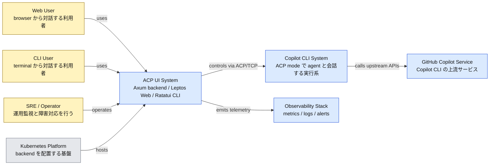
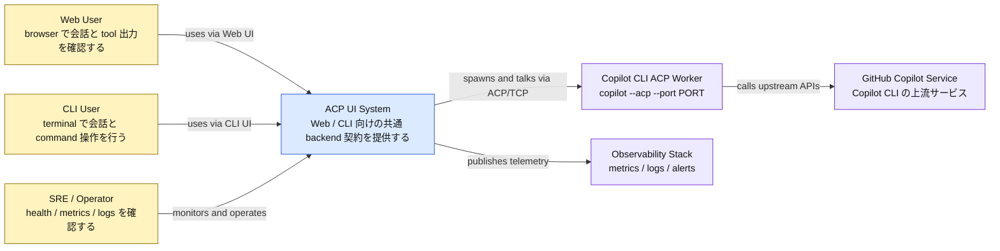
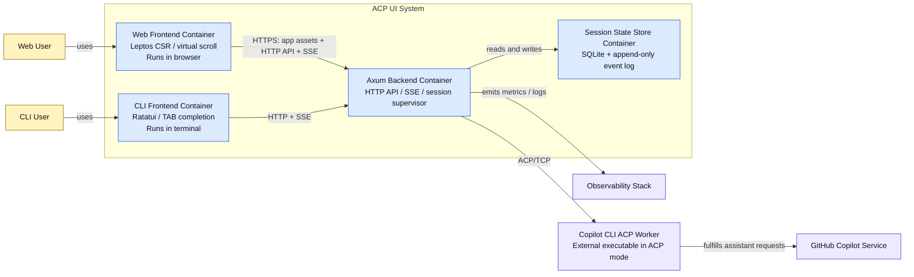
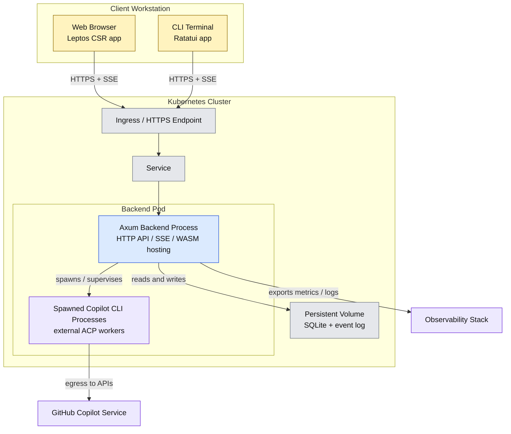
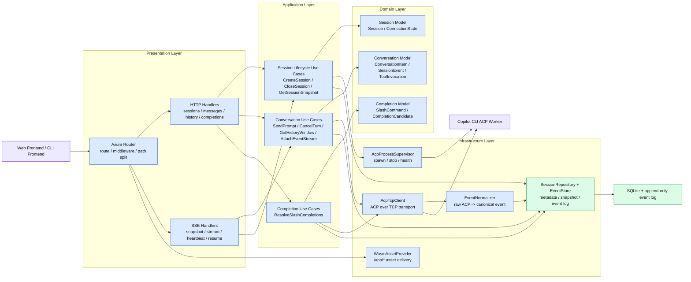

# ACP Web / CLI Target Architecture

このページは、Copilot CLI を ACP モードで起動したうえで、その前段に置く
Web バックエンド、Web フロントエンド、CLI フロントエンドの**目標アーキテクチャ**を
説明する Explanation です。現行 repo の実装済み挙動を列挙する文書ではなく、
origin/main からやり直す再設計の到達点を整理するための設計書です。runtime / path
の事実関係は
`docs/reference/control-plane-runtime.md`、現行構成に至る経緯は
`docs/explanation/history.md` を見てください。

## 0. この文書の位置づけ

- これは **target design** であり、現状実装の仕様書ではない
- ここでいう Web / CLI / backend の責務は、今後の実装判断の基準を示す
- 実装が追いついていない箇所があっても、この文書では「どこへ寄せるべきか」を優先する

## 1. 目的

既存の Copilot CLI を `copilot --acp --port <port>` で起動し、その ACP セッションを
扱う 3 面の**再設計方針**を定義します。

- Web バックエンドサーバー
- Web フロントエンドクライアント
- CLI フロントエンドクライアント

主眼は、**ACP を UI に直接見せず、バックエンドが ACP 接続とイベント整形を吸収し、
Web / CLI の両方に一貫した API と SSE を提供すること**です。

## 2. 最終成果物

- Axum ベースの Web バックエンドサーバー
- Leptos CSR ベースの Web フロントエンドクライアント
- Ratatui ベースの CLI フロントエンドクライアント

## 3. 採用技術

### バックエンド

- Axum
- SSE
- Clean Architecture
- Tokio
- 既存 `exec-api` / `runtime-tools` の process 管理・state 取扱いパターンを参考にする

### Web フロントエンド

- Leptos
- CSR レンダリング
- 仮想スクロール
- HTTP command API + SSE 購読

### CLI フロントエンド

- Ratatui
- TAB 補完（スラッシュコマンド中心）
- HTTP command API + SSE 購読

## 4. 全体アーキテクチャ

```text
+-------------------+        HTTP + SSE        +----------------------+
| Web Frontend      | <----------------------> | Axum Backend         |
| Leptos CSR        |                          | - Presentation       |
| Virtual Scroll    |                          | - Application        |
+-------------------+                          | - Domain             |
                                               | - Infrastructure     |
+-------------------+        HTTP + SSE        | - Session Supervisor |
| CLI Frontend      | <----------------------> | - ACP Adapter        |
| Ratatui           |                          +----------+-----------+
| TAB Completion    |                                     |
+-------------------+                                     | TCP
                                                          v
                                               +----------------------+
                                               | Copilot CLI          |
                                               | --acp --port <port>  |
                                               +----------------------+
```

この構成では、Web と CLI は同じ backend contract を共有し、ACP との TCP 通信は
Axum バックエンドだけが引き受けます。

### 4.1 システムランドスケープ図

以下は、この再設計が置かれる周辺システム全体を俯瞰する C4 の
System Landscape 相当の図です。



### 4.2 コンテキスト図

以下は、対象システムを black box として見た C4 の System Context 相当の図です。



### 4.3 コンテナ図

以下は、ACP UI System の内部を deployable / runnable unit ごとに分解した
C4 の Container 相当の図です。



### 4.4 デプロイメント図

以下は、想定する実行配置を示す C4 の Deployment 相当の図です。



### 4.5 コンポーネント図

以下は、Axum Backend Container の内部責務を分解した C4 の Component 相当の図です。



## 5. なぜ Web と CLI を backend 経由で統一するのか

ブラウザや CLI から ACP へ直接接続させると、接続管理、再接続、イベント整形、
completion の仕様が分散します。この設計では両 front-end を backend 経由へそろえ、
次の点を優先します。

- ACP の raw protocol を UI へ漏らさない
- Web と CLI の event / completion semantics をそろえる
- reconnect と session 管理を backend に集約する
- SRE 観点で障害点を「backend」か「ACP worker」かへ切り分けやすくする

つまり backend は単なる proxy ではなく、**ACP adapter + session supervisor**
として振る舞います。

## 6. なぜ下りを SSE、上りを HTTP に分けるのか

assistant 応答や tool log は継続的に流れるため、server-to-client は SSE が向きます。
一方で prompt 送信、cancel、session close、completion query は request/response
の形のほうが単純です。

そのため通信は次のように分けます。

- 下り: SSE
  - assistant delta
  - tool progress
  - session state change
  - heartbeat
- 上り: HTTP
  - prompt 送信
  - cancel
  - close
  - history 取得
  - slash completion

Web と CLI が同じ形で扱えることも、この分離を採る大きな理由です。

## 7. セッションモデル

### 7.1 単位

- `FrontendSession`
  - Web または CLI から見える論理セッション
  - 会話履歴、event stream、UI 状態の単位
- `AcpWorker`
  - `copilot --acp --port <port>` で起動される backend 管理下の worker

初期実装では **1 FrontendSession : 1 AcpWorker** を採ります。

### 7.2 この方針を採る理由

- ACP の状態競合を避けやすい
- 同一 session への複数 client attach を扱いやすい
- worker 再起動と session 破棄の境界が明確になる
- 障害影響を session 単位へ閉じ込めやすい

### 7.3 寿命

- `create session` で backend が worker を起動
- 最後の client が切断されても短時間は保持
- TTL 超過または明示 close で worker を停止
- 再接続時は snapshot と event sequence を返して stream を再開

### 7.4 AcpWorker の test 実装方針

`AcpWorker` には、本番用の Copilot 実装と test 用の mock 実装を分けて持ちます。

- 本番実装
  - backend が `copilot --acp --port <port>` を子 process として起動する
  - `AcpProcessSupervisor` と `AcpTcpClient` が worker の起動監視と ACP 通信を受け持つ
- test 実装
  - `agentclientprotocol/rust-sdk` の
    `agent-client-protocol/examples/agent` を元に、Agent 側の mock 実装を作る
  - backend の HTTP / SSE / event normalization を検証するときは、実 Copilot の代わりに
    この mock agent を `AcpWorker` として起動する

mock agent の責務は、ACP server ではなく**Agent 側のふるまいを再現すること**です。
少なくとも次を deterministic に返せるようにします。

- prompt に対する応答ストリーム
- tool call の開始 / 進行 / 完了
- slash completion 候補
- cancel / error / connection close の異常系

これにより backend test は「Copilot 実装の詳細」ではなく、**ACP 越しの Agent 応答を
backend がどう解釈して UI 契約へ落とすか**に集中できます。

## 8. バックエンド設計

### 8.1 Clean Architecture

#### Domain

- 責務
  - backend が扱う会話・セッション・補完・接続状態の**業務概念と不変条件**を定義する
  - Application から見た共通言語を提供し、Axum / SSE / ACP / SQLite などの
    実装都合を持ち込まない
  - event sequence の単調増加、session state transition、conversation item の
    整列ルールなど、backend 内で崩してはいけない条件を表す
- `Session`
  - FrontendSession の identity、状態、寿命、attach 数、close 条件を表す集約
- `ConversationItem`
  - transcript に表示される assistant / user / tool 出力の正規化済み単位を表す
- `SessionEvent`
  - backend 内の canonical event。再接続や履歴再生に使う sequence 付きイベントを表す
- `ToolInvocation`
  - tool 実行 1 件の識別子、状態遷移、関連 log を追跡する
- `SlashCommand`
  - slash command 自体の意味、入力制約、補完対象を表す
- `CompletionCandidate`
  - Web / CLI で共通利用する補完候補の最小表現を定義する
- `ConnectionState`
  - frontend-backend 間、および backend-worker 間の接続状態を UI 非依存で表す

Domain は Axum, SSE, ACP 固有型に依存しません。

#### Application

- 責務
  - Presentation から受けた要求を**ユースケース単位で調停**し、必要な port を介して
    worker 起動、状態更新、event 生成、履歴取得を進める
  - 業務ルールの実行順序と境界を管理し、Infrastructure の詳細を外へ漏らさない
  - request validation のうち「入力形式」ではなく「業務的に許容できるか」を判定する
- `CreateSession`
  - session ID 発行、初期状態作成、AcpWorker 起動要求、初回 snapshot 準備を行う
- `AttachEventStream`
  - SSE attach の妥当性を確認し、必要な replay 範囲と live stream 開始位置を決める
- `SendPrompt`
  - session が送信可能か判定し、prompt 受付イベントを作成して worker 送信を指示する
- `CancelTurn`
  - 実行中 turn の有無を見て cancel を発行し、結果を session state に反映する
- `CloseSession`
  - session close を確定し、worker 停止、最終 snapshot 保存、後始末を指示する
- `GetHistoryWindow`
  - 仮想スクロールや再接続で必要な履歴範囲を cursor/sequence ベースで切り出す
- `ResolveSlashCompletions`
  - static command 定義と ACP 由来候補を統合し、UI 共通形式へ正規化する
- `GetSessionSnapshot`
  - 現在の transcript 要約、接続状態、worker 状態をまとめて返す

#### Infrastructure

- 責務
  - ACP 通信、process 管理、永続化、asset 配信などの**I/O と外部境界**を実装する
  - Application が必要とする port を具体実装で満たし、再利用可能な adapter として提供する
  - test では実 Copilot の代わりに mock agent を差し替えられる構成を用意する
- `AcpProcessSupervisor`
  - `copilot --acp --port <port>` または test 用 mock agent を起動・停止・監視する
  - port 割当、PID 管理、異常終了検知、graceful shutdown を受け持つ
- `AcpTcpClient`
  - ACP over TCP の接続、message serialize/deserialize、timeout/backpressure 制御を行う
- `EventNormalizer`
  - ACP の raw event / response を `SessionEvent` や `ConversationItem` へ正規化する
  - delta の束ね、tool event の整形、sequence 採番対象の決定を受け持つ
- `SessionRepository`
  - session metadata、TTL、worker ひも付け、attach 数などの現在値を保存する
- `EventStore`
  - append-only event と snapshot を保持し、history/replay/reconnect の読み出しに使う
- `WasmAssetProvider`
  - Leptos CSR bundle の配置、versioning、配信元切替に必要な情報を提供する

#### Presentation

- 責務
  - 外部 API 契約を公開し、HTTP / SSE の入出力を Application のユースケースへ変換する
  - transport 固有の validation、status code、error body、SSE keepalive を扱う
  - raw ACP 情報ではなく、UI 契約として公開してよい DTO だけを返す
- Axum Router
  - route 構成、middleware 適用、API path と asset path の分離を定義する
- HTTP handlers
  - request DTO の decode/validation、use case 呼び出し、response 変換を行う
- SSE handlers
  - 初回 snapshot、live event 配信、heartbeat、resume cursor 解釈を扱う
- DTO / response mapping
  - domain/application の型を公開 JSON / SSE schema へ写像し、内部型を隠蔽する

依存方向は `Presentation -> Application -> Domain` を基本とし、Infrastructure は
Application が定義する port を実装して内側へ差し込む構成にします。

### 8.2 ACP adapter の責務

backend は ACP の raw event をそのまま流しません。`EventNormalizer` で UI 向け event
へ変換し、必要に応じて:

- assistant の断片出力を 1 つの stream に束ねる
- tool 実行の開始 / 進行 / 完了を UI 向けに整形する
- reconnect 用 snapshot を event store に保存する
- slash completion を UI 共通形式へ変換する

### 8.3 クライアント向け API

| Method | Path | 用途 |
| --- | --- | --- |
| `POST` | `/api/v1/sessions` | session 作成 |
| `GET` | `/api/v1/sessions/{id}` | session snapshot 取得 |
| `GET` | `/api/v1/sessions/{id}/events` | SSE 購読 |
| `GET` | `/api/v1/sessions/{id}/history` | 履歴ページ取得 |
| `POST` | `/api/v1/sessions/{id}/messages` | prompt 送信 |
| `POST` | `/api/v1/sessions/{id}/cancel` | 実行中 turn の cancel |
| `POST` | `/api/v1/sessions/{id}/close` | session 終了 |
| `GET` | `/api/v1/completions/slash` | slash command 補完 |
| `GET` | `/healthz` | liveness / readiness |

### 8.4 SSE event contract

主な event type は次のとおりです。

- `session.snapshot`
- `session.state.changed`
- `message.accepted`
- `assistant.delta`
- `assistant.completed`
- `tool.started`
- `tool.log`
- `tool.completed`
- `completion.hints`
- `warning`
- `error`
- `heartbeat`

### 8.5 状態保持

保持対象は次を基本とします。

- session metadata
- event sequence
- 最新 snapshot
- connection state
- completion catalog cache

初期実装では backend ローカルの永続化を持ち、少なくとも backend 再起動には耐える
方針です。保存先は既存 control-plane の state 配下を基本候補にし、SQLite +
append-only event log を第一案とします。

### 8.6 WASM 配信

標準案では Axum が `/app/*` 配下で Leptos CSR bundle を配信します。必要に応じて
CDN / ingress 配信へ切り替えられるよう、API path と asset path は分けます。

## 9. Web フロントエンド設計

### 9.1 画面構成

- Session list pane
- Transcript pane
- Composer
- Slash command palette
- Tool activity panel
- Connection / worker state badge

### 9.2 状態管理

state は次の 3 層に分けます。

- `Server State`
  - snapshot
  - history
  - completions
- `Live Stream State`
  - SSE で流れる delta / event
- `UI State`
  - pane selection
  - scroll position
  - draft input

### 9.3 仮想スクロールを採る理由

長い transcript と tool log をそのまま描画すると、CSR では DOM 負荷が高くなります。
そのため Web は仮想スクロールを前提にします。

- 描画対象は viewport 周辺だけに絞る
- item key は `event_sequence`
- 上方向スクロール時は `history` API で追加取得する
- SSE で届く末尾データは tail append で反映する
- 高さが変わる item は推定高さ + 再計測で扱う

### 9.4 UX 方針

- assistant 応答は delta 単位で追記
- tool log は折りたたみ可能
- worker 切断時は banner と再接続導線を出す
- slash command 入力中は即時 completion を出す

## 10. CLI フロントエンド設計

### 10.1 画面構成

- 左: session / command pane
- 中央: transcript pane
- 下: input composer
- 右または下段: tool / status pane

### 10.2 通信

- snapshot / history は HTTP
- live event は SSE
- prompt / cancel / session 操作は HTTP
- Web と同じ backend contract を使う

### 10.3 TAB 補完

TAB 補完は slash command を主対象とし、backend の completion API を使って
Web と CLI の候補内容をそろえます。

- backend は `label`, `insert_text`, `detail`, `kind` を返す
- Ratatui は current token と cursor position から補完要求を出す
- 補完ロジックは client ごとに重複実装しない

### 10.4 UX 方針

- transcript は follow mode / manual scroll mode を分ける
- heartbeat 欠落時は connection state を目立つ位置に出す
- tool 出力は会話本文と pane を分け、本文を埋めにくくする

## 11. 運用・監視観点

### 11.1 監視したいもの

- backend process health
- session 数
- active worker 数
- worker 起動失敗率
- SSE 接続数
- session ごとの event backlog
- completion API latency

### 11.2 障害切り分け

- backend dead
  - `/healthz` fail
  - 全 client へ影響
- worker dead
  - 特定 session だけ degraded
- SSE 断
  - client は再接続し、snapshot を再取得
- ACP protocol error
  - backend が `error` event へ変換して UI に通知

### 11.3 セキュリティ原則

- ACP の TCP port は外部公開しない
- クライアントは必ず backend 経由にする
- backend は UI に返す event を明示的に選別する
- token / state / log は既存 control-plane の権限モデルに従う

## 12. 実装順序

1. shared contract
   - session DTO
   - SSE event schema
   - completion schema
2. backend MVP
   - session create
   - ACP worker spawn / connect
   - prompt submit
   - SSE stream
3. Web MVP
   - transcript
   - composer
   - virtual scroll
4. CLI MVP
   - transcript
   - input
   - slash completion
5. resilience
   - reconnect
   - snapshot / history
   - metrics / logging

## 13. この設計で固定した判断

1. Web / CLI は backend 経由で統一する
2. 下りは SSE、上りは HTTP とする
3. 初期実装は 1 session : 1 ACP worker とする
4. Web は CSR + 仮想スクロールを前提とする
5. completion は backend に寄せて Web / CLI で共通化する

## 14. 残課題

- 認証 / 認可の最終方式
- session TTL の既定値
- event store の詳細フォーマット
- WASM を backend 配信にするか外部配信にするか
- CLI の multi-pane レイアウト詳細
