# ACP Web / CLI Target Architecture

このページは、Copilot CLI を ACP モードで起動したうえで、その前段に置く
Web バックエンド、Web フロントエンド、CLI フロントエンドの**目標アーキテクチャ**を
説明する Explanation です。現行 repo の実装済み挙動を列挙する文書ではなく、
origin/main からやり直す再設計の到達点を整理するための設計書です。runtime / path
の事実関係は
`docs/reference/control-plane-runtime.md`、現行構成に至る経緯は
`docs/explanation/history.md` を見てください。

## 0. この文書の位置づけ

- これは **target design** であり、現状実装の仕様書ではない
- ここでいう Web / CLI / backend の責務は、今後の実装判断の基準を示す
- 実装が追いついていない箇所があっても、この文書では「どこへ寄せるべきか」を優先する

## 1. 目的

既存の Copilot CLI を `copilot --acp --port <port>` で起動し、その ACP セッションを
扱う 3 面の**再設計方針**を定義します。

- Web バックエンドサーバー
- Web フロントエンドクライアント
- CLI フロントエンドクライアント

主眼は、**ACP を UI に直接見せず、バックエンドが ACP 接続とイベント整形を吸収し、
Web / CLI の両方に一貫した API と SSE を提供すること**です。

## 2. 最終成果物

- Axum ベースの Web バックエンドサーバー
- Leptos CSR ベースの Web フロントエンドクライアント
- Ratatui ベースの CLI フロントエンドクライアント

## 3. 採用技術

### バックエンド

- Axum
- SSE
- Clean Architecture
- Tokio
- 既存 `exec-api` / `runtime-tools` の process 管理・state 取扱いパターンを参考にする

### Web フロントエンド

- Leptos
- CSR レンダリング
- 仮想スクロール
- HTTP command API + SSE 購読

### CLI フロントエンド

- Ratatui
- TAB 補完（スラッシュコマンド中心）
- HTTP command API + SSE 購読

## 4. 全体アーキテクチャ

```text
+-------------------+        HTTP + SSE        +----------------------+
| Web Frontend      | <----------------------> | Axum Backend         |
| Leptos CSR        |                          | - Presentation       |
| Virtual Scroll    |                          | - Application        |
+-------------------+                          | - Domain             |
                                               | - Infrastructure     |
+-------------------+        HTTP + SSE        | - Session Supervisor |
| CLI Frontend      | <----------------------> | - ACP Adapter        |
| Ratatui           |                          +----------+-----------+
| TAB Completion    |                                     |
+-------------------+                                     | loopback TCP
                                                          v
                                               +----------------------+
                                               | Copilot CLI          |
                                               | --acp --port <port>  |
                                               +----------------------+
```

この構成では、Web と CLI は同じ backend contract を共有し、ACP との loopback TCP 通信は
Axum バックエンドだけが引き受けます。

### 4.1 システムランドスケープ図

以下は、この再設計が置かれる周辺システム全体を俯瞰する C4 の
System Landscape 相当の図です。

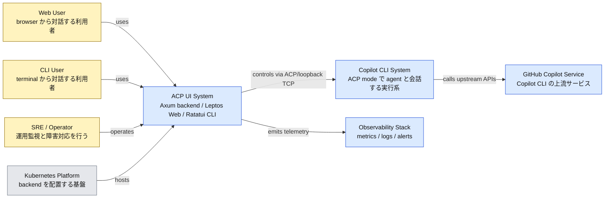

### 4.2 コンテキスト図

以下は、対象システムを black box として見た C4 の System Context 相当の図です。

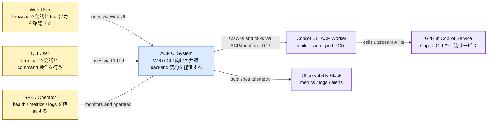

### 4.3 コンテナ図

以下は、ACP UI System の内部を deployable / runnable unit ごとに分解した
C4 の Container 相当の図です。

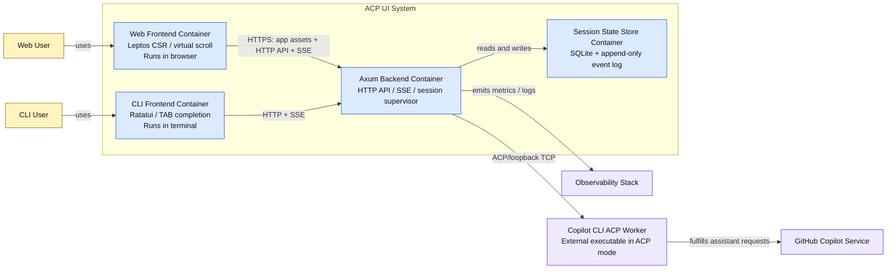

### 4.4 デプロイメント図

以下は、想定する実行配置を示す C4 の Deployment 相当の図です。

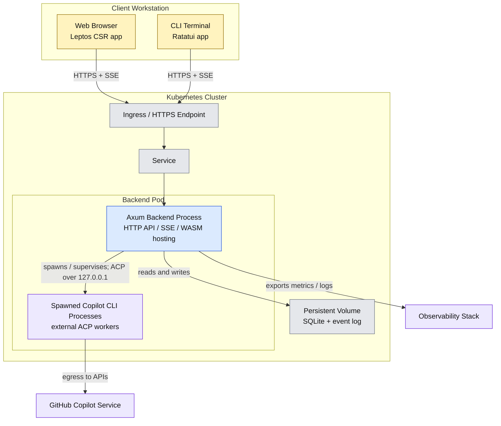

### 4.5 コンポーネント図

以下は、Axum Backend Container の内部責務を分解した C4 の Component 相当の図です。

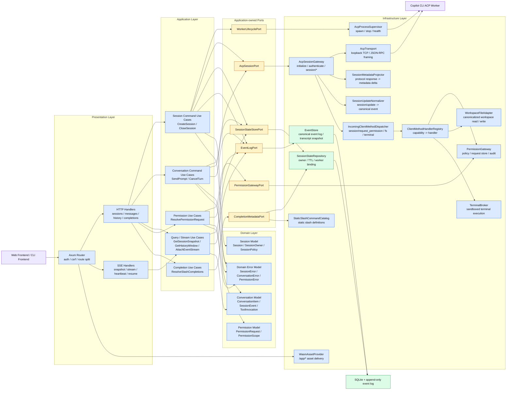

### 4.6 図の読み方

C4 図は「何があるか」を示す静的な図です。下の表の順で読むと、
**境界 → 構成要素 → 動き → 障害時の戻り方**の順で把握しやすくなります。

| 図 | 主に答える問い | 説明時のポイント |
| --- | --- | --- |
| 4.1 システムランドスケープ図 | この再設計は何とつながるのか | Web/CLI/backend が 1 つの UI 系であり、Copilot CLI と運用基盤の間に立つこと |
| 4.2 コンテキスト図 | 対象システムの責任範囲はどこまでか | ACP を直接 UI に見せず、backend が吸収すること |
| 4.3 コンテナ図 | どの成果物と主要内部要素があるのか | 3 つの成果物（Web、CLI、Axum backend）と、backend が依存する state store を分けて見られること |
| 4.4 デプロイメント図 | 実際にどこへ置くのか | browser/terminal と cluster の責務分離、worker が backend 管理下で動くこと |
| 4.5 コンポーネント図 | backend の中で誰が何を担うのか | Presentation / Application / Domain / Infrastructure の分離 |
| 4.7 シーケンス図 | 実際の利用フローはどう流れるか | session 作成、permission 仲介を含む会話実行、再接続、補完、終了、client capability 仲介の 6 シナリオ |
| 4.8 状態遷移図 | 平常時・異常時にどう状態が進むか | session と worker をどこで作り、どこで閉じるか |

### 4.7 主要シナリオのシーケンス図

以下の HTTP / SSE 呼び出しは、すべて認証済み principal から行われる前提です。
session-scoped endpoint では **session owner 一致**を確認し、MVP では session 共有と
operator override を受け付けません。

#### 4.7.1 セッション作成と初回接続

この図は、「ユーザーが会話を始めると backend が worker を起動し、ACP の
`initialize` / `authenticate` / `session/new` を経て、SSE で初回状態を配るまで」を
示します。

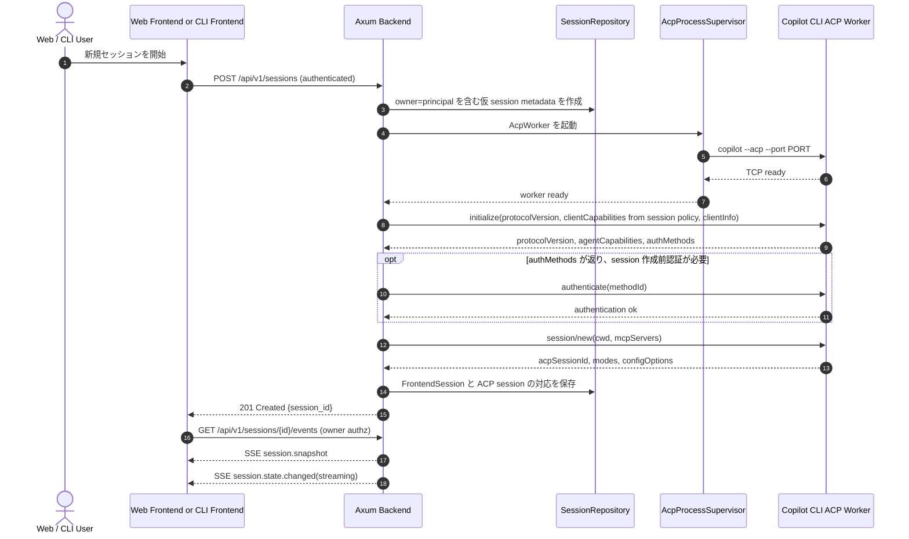

#### 4.7.2 1 turn の実行と SSE 配信

この図は、「prompt を投げてから assistant 応答と tool event が UI に流れるまで」の
主経路です。**上りは HTTP、下りは SSE** の分離を見る図です。
必要に応じて、途中で `session/request_permission` を受けて UI 側の判断を挟みます。
ACP は同一接続上の**双方向 JSON-RPC**なので、`session/prompt` の response を待っている間も、
worker から client method が割り込んできます。
`session/prompt` 自体は long-running な request/response であり、turn 完了時に
**元の request に対する response**として `stopReason` が返ります。

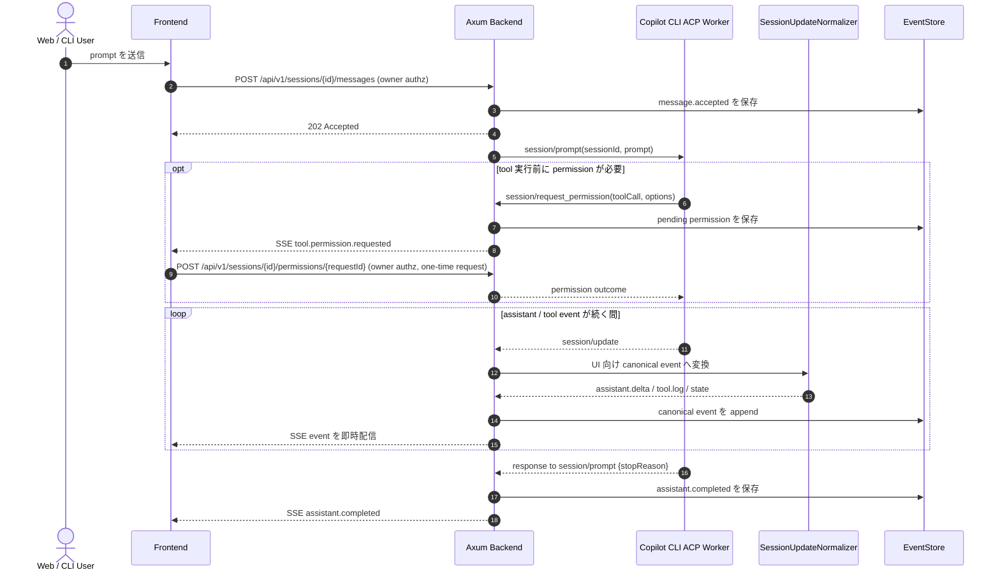

#### 4.7.3 再接続と履歴リプレイ

この図は、「SSE が切れたあとに同じ session へ戻る流れ」を示します。
**切断時も backend が state を持つので会話が壊れにくい**ことを示す図です。

ここでいう TTL は、**attach 中の client 数が 0 になった時点で開始し、client が再接続したら
リセットする**運用を前提にします。TTL の**具体的な秒数**は Section 14 の残課題です。
この図は **worker が存続している再 attach 経路**を示します。worker / backend をまたぐ
復旧は、Section 7.4 のとおり `loadSession` capability がある場合にだけ `session/load`
で再構成します。

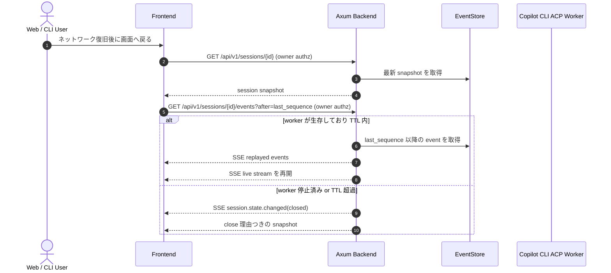

#### 4.7.4 slash command 補完

この図は、Web / CLI の両方が同じ backend 補完 API を使い、候補の意味を揃える流れです。
ACP schema には補完専用 RPC がないため、補完は backend が static command 定義と
ACP から取得済みの metadata を使って解決します。

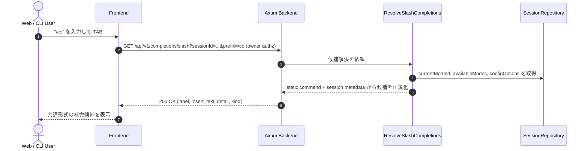

#### 4.7.5 セッション終了と worker 停止

この図は、明示 close と TTL による自動 cleanup が、どちらも同じ終了処理へ合流することを
示します。

active turn 実行中に明示 close が来た場合は、backend 内部では必要な cancel / drain を行ったあとで
`Closing` へ進む前提です。

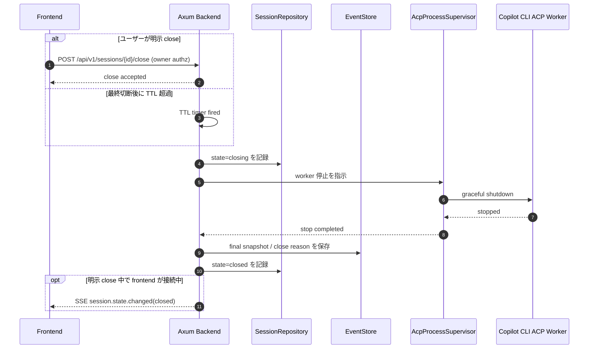

`Closed` になった session は、その場で履歴を捨てるのではなく、**read-only の参照と
障害調査に使う retention window の間は final snapshot と event log を保持し、その後に
archive または delete する**前提です。retention window の**具体的な長さ**は、
Section 14 の残課題です。

#### 4.7.6 Client capability の仲介

この図は、Agent が同一 ACP 接続上で client 側の `fs/*` / `terminal/*` を呼ぶ場合に、
backend が workspace / terminal broker として振る舞う経路を示します。

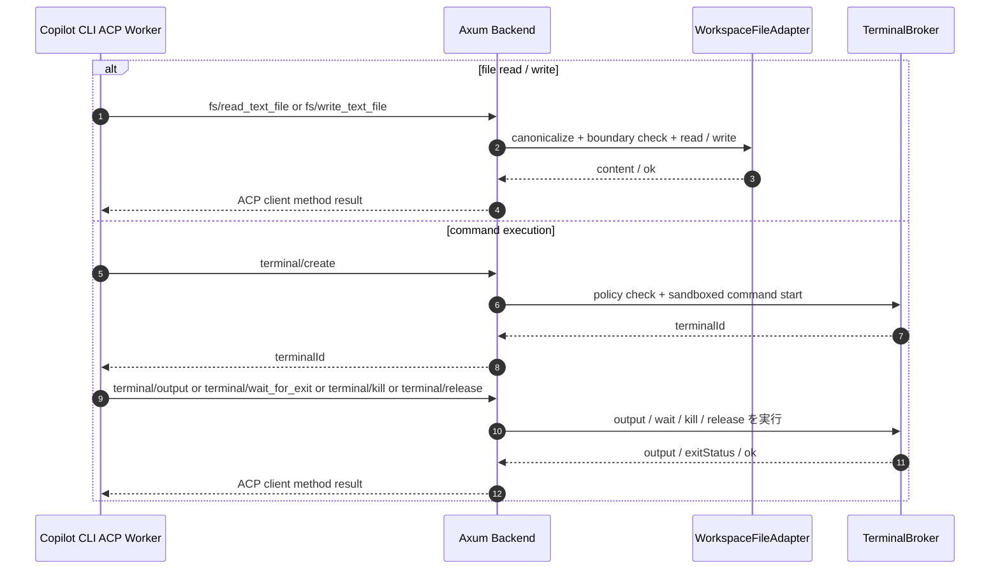

### 4.8 FrontendSession 状態遷移図（AcpWorker は従属 resource）

この図は、session と worker を 1:1 で持つ前提のもとで、通常系と異常系の大きな状態遷移を
示します。**どこで resources が増え、どこで確実に掃除されるか**を見る図です。

state 名は **FrontendSession を主語**にしたものです。AcpWorker の状態は、各遷移に付随する
副作用として折りたたんで表現します。

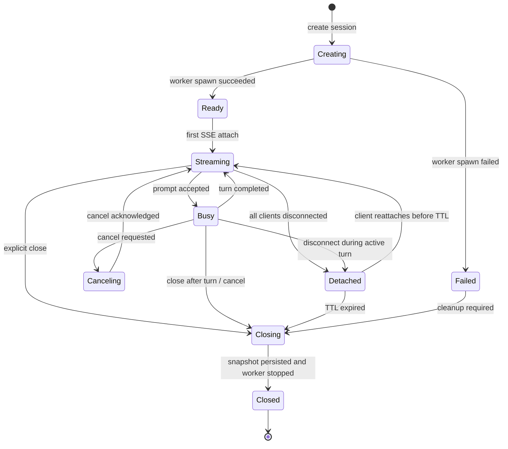

## 5. なぜ Web と CLI を backend 経由で統一するのか

ブラウザや CLI から ACP へ直接接続させると、接続管理、再接続、イベント整形、
completion の仕様が分散します。この設計では両 front-end を backend 経由へそろえ、
次の点を優先します。

- ACP の raw protocol を UI へ漏らさない
- Web と CLI の event / completion semantics をそろえる
- reconnect と session 管理を backend に集約する
- SRE 観点で障害点を「backend」か「ACP worker」かへ切り分けやすくする

つまり backend は単なる proxy ではなく、**ACP adapter + session supervisor**
として振る舞います。

## 6. なぜ下りを SSE、上りを HTTP に分けるのか

assistant 応答や tool log は継続的に流れるため、server-to-client は SSE が向きます。
一方で prompt 送信、cancel、session close、permission 応答、completion query は request/response
の形のほうが単純です。

そのため通信は次のように分けます。

- 下り: SSE
  - assistant delta
  - tool progress
  - permission request
  - session state change
  - heartbeat
- 上り: HTTP
  - prompt 送信
  - cancel
  - close
  - permission 応答
  - history 取得
  - slash completion

Web と CLI が同じ形で扱えることも、この分離を採る大きな理由です。

## 7. セッションモデル

### 7.1 単位

- `FrontendSession`
  - Web または CLI から見える論理セッション
  - 会話履歴、event stream、UI 状態の単位
- `SessionOwner`
  - backend が認証済み principal から切り出して FrontendSession に束ねる所有者情報
  - session-scoped API / SSE / reconnect の認可判定に使う
- `AcpWorker`
  - `copilot --acp --port <port>` で起動される backend 管理下の worker

初期実装では **1 FrontendSession : 1 AcpWorker** を採ります。
session ID 自体は CSPRNG で生成しますが、**owner check が主たる保護**であり、
ID を知っているだけでは access できない前提です。

### 7.2 この方針を採る理由

- ACP の状態競合を避けやすい
- 同一 session への複数 client attach を扱いやすい
- worker 再起動と session 破棄の境界が明確になる
- 障害影響を session 単位へ閉じ込めやすい

### 7.3 寿命

- `create session` で backend が worker を起動
- 最後の client が切断された時点で TTL カウントを開始し、短時間は保持
- TTL 中に client が再接続した場合はカウントをリセットする
- TTL 超過または明示 close で worker を停止
- 再接続時は snapshot と event sequence を返して stream を再開

### 7.4 ACP session negotiation

backend は `AcpWorker` に対して ACP の **Client** として振る舞います。したがって、
worker の TCP port へ接続できた時点ではまだ session は作成されておらず、次の順序を
踏む必要があります。

1. `initialize`
   - backend は `protocolVersion`, `clientCapabilities`, `clientInfo` を送る
   - worker から `protocolVersion`, `agentCapabilities`, `authMethods` を受け取る
2. 必要なら `authenticate`
   - 通常は `authMethods` に基づいて `session/new` の前に実施する
   - 未認証のまま `session/new` を投げて `auth_required` を受けた場合も、
     `authenticate` 後に `session/new` を再試行する
3. `session/new`
   - `cwd` と `mcpServers` を渡して ACP 上の session を作る
   - `sessionId`, `modes`, `configOptions` を保持する

`clientCapabilities` は backend が**本当に提供できる ACP client methods**と一致させ、
session ごとの `SessionPolicy` から導きます。

- `session/request_permission`
  - ACP client の baseline method として常に処理対象
- `fs.readTextFile`
  - workspace root が設定され、read scope が許可された session でだけ `true`
- `fs.writeTextFile`
  - destructive capability とみなし、既定値は `false`
- `terminal`
  - destructive capability とみなし、sandbox / limit / audit を満たす profile でだけ `true`

未実装または policy で無効な capability は `false` で広告します。

backend 内の `FrontendSession` は UI 向けの論理 ID であり、ACP の `sessionId` とは分けて
管理します。初期実装では **1 FrontendSession : 1 AcpWorker : 1 ACP session** を採ります。
`FrontendSession` は owner を持ち、MVP では **同一 owner だけ**が snapshot / history /
events / messages / permissions / close を実行できます。

ACP は同一 TCP connection 上で双方向 JSON-RPC を流すため、backend が
`session/prompt` の response を待っている間でも、worker から
`session/request_permission` や `fs/*` / `terminal/*` が呼ばれる前提で設計します。

worker の ACP endpoint は backend と同一 pod / network namespace 内の
`127.0.0.1:ephemeral-port` だけで待ち受ける前提とし、`AcpProcessSupervisor` が port 割当、
child readiness、異常終了監視を受け持ちます。loopback bind を強制できない配置では、
この TCP モードを採用しません。

再 attach で worker が生きている間は、同じ ACP session をそのまま使います。一方、
worker や backend をまたいで live session を復旧したい場合は、worker が
`loadSession` capability を広告している場合にだけ `session/load` を使えます。
`loadSession` が無い場合、backend は保持している transcript / snapshot を read-only
表示できますが、ACP 上の live context 自体は再開できません。

### 7.5 AcpWorker の test 実装方針

`AcpWorker` には、本番用の Copilot 実装と test 用の mock 実装を分けて持ちます。

- 本番実装
  - backend が `copilot --acp --port <port>` を子 process として起動する
  - `AcpProcessSupervisor`, `AcpTransport`, `AcpSessionGateway` が worker の起動監視と
    ACP 通信を受け持つ
- test 実装
  - `agentclientprotocol/rust-sdk` の
    `agent-client-protocol/examples/agent` を元に、Agent 側の mock 実装を作る
  - backend の HTTP / SSE / event normalization を検証するときは、実 Copilot の代わりに
    この mock agent を `AcpWorker` として起動する

mock agent の責務は、ACP server ではなく**Agent 側のふるまいを再現すること**です。
少なくとも次を deterministic に返せるようにします。

- `initialize` の応答
  - `protocolVersion`, `agentCapabilities`, `authMethods`
- `authenticate` / `session/new` / 必要なら `session/load` の応答
  - `sessionId`, `modes`, `configOptions`
- `session/request_permission` の発火
- `fs/read_text_file` / `fs/write_text_file` / `terminal/*` の client method 呼び出し
- prompt に対する応答ストリーム
- tool call の開始 / 進行 / 完了
- `current_mode_update` など session metadata 更新
- cancel / error / connection close の異常系

これにより backend test は「Copilot 実装の詳細」ではなく、**ACP 越しの Agent 応答を
backend がどう解釈して UI 契約へ落とすか**に集中できます。

## 8. バックエンド設計

### 8.1 Clean Architecture

#### Application-owned ports

Clean Architecture を**構成として強制**するため、Application layer は次の port / trait を
所有します。Infrastructure はこの port を実装して差し込み、use case から
`AcpSessionGateway` や repository の具体型を直接見せません。

| Port / trait | 主な責務 | 主な実装 |
| --- | --- | --- |
| `WorkerLifecyclePort` | worker の起動・停止・health 確認 | `AcpProcessSupervisor` |
| `AcpSessionPort` | `initialize` / `authenticate` / `session/*` 呼び出しと inbound ACP stream の受け渡し | `AcpSessionGateway` |
| `SessionStateStorePort` | session owner、lifecycle state、worker binding、TTL、negotiated metadata の保存/読出し | `SessionStateRepository` |
| `EventLogPort` | canonical event の append、replay、transcript snapshot の取得 | `EventStore` |
| `PermissionGatewayPort` | permission request の作成・解決・期限切れ・監査 | `PermissionGateway` |
| `CompletionMetadataPort` | static command 定義と session metadata の読出し | `SessionStateRepository` + `StaticSlashCommandCatalog` |

#### Domain

- 責務
  - backend が扱う会話・session 所有権・permission scope・error taxonomy の
    **業務概念と不変条件**を定義する
  - Application から見た共通言語を提供し、Axum / SSE / ACP / SQLite / browser UI の
    実装都合を持ち込まない
  - event sequence の単調増加、session state transition、permission scope の整合性、
    conversation item の整列ルールなど、backend 内で崩してはいけない条件を表す
- `Session`
  - FrontendSession の identity、owner、状態、寿命、attach 数、close 条件を表す集約
- `SessionOwner`
  - 認証済み principal と role/scope を表し、session-scoped API の認可判定に使う
- `SessionPolicy`
  - capability profile、workspace root、permission policy、resource limit profile を表す
- `ConversationItem`
  - transcript に表示される assistant / user / tool 出力の正規化済み単位を表す
- `SessionEvent`
  - backend 内の canonical event。再接続や履歴再生に使う sequence 付きイベントを表す
- `ToolInvocation`
  - tool 実行 1 件の識別子、状態遷移、関連 log を追跡する
- `PermissionRequest`
  - 誰がどの scope を承認待ちかを表す one-time request を表す
- `DomainError`
  - `SessionError`, `ConversationError`, `PermissionError` のように、外部要因を
    domain 意味へ写像した error taxonomy を表す

`ConnectionBadgeState`, `CompletionCandidate`, `SessionSnapshotView` のような UI / query
contract は Domain ではなく Application / Presentation が持ちます。Domain は Axum, SSE,
ACP 固有型に依存しません。

#### Application

- 責務
  - Presentation から受けた要求を**command / query / stream use case**に分けて調停し、
    必要な port を介して worker 起動、状態更新、event 生成、履歴取得を進める
  - 業務ルールの実行順序と境界を管理し、Infrastructure の詳細や raw ACP message を
    外へ漏らさない
  - request validation のうち「入力形式」ではなく「業務的に許容できるか」を判定する
  - Infrastructure error を `DomainError` へ写像し、外部へ漏らす error 形を制御する
- `CreateSession`
  - session ID 発行、owner / policy の束縛、AcpWorker 起動、`initialize` / 必要なら
    `authenticate` / `session/new` 実行、初回 snapshot 準備を行う
- `CloseSession`
  - session close を確定し、worker 停止、最終 snapshot 保存、後始末を指示する
- `SendPrompt`
  - session が送信可能か判定し、prompt 受付イベントを作成して worker 送信を指示する
  - inbound ACP update を canonical event へ落とし込み、どの event を保存・配信するかを決める
- `CancelTurn`
  - 実行中 turn の有無を見て cancel を発行し、結果を session state に反映する
- `GetSessionSnapshot`
  - 現在の transcript 要約、接続状態、worker 状態、mode / config 状態をまとめて返す
- `GetHistoryWindow`
  - 仮想スクロールや再接続で必要な履歴範囲を cursor/sequence ベースで切り出す
- `AttachEventStream`
  - SSE attach の妥当性を確認し、必要な replay 範囲と live stream 開始位置を決める
- `ResolvePermissionRequest`
  - pending permission request に対する user / policy の判断を受け取り、one-time consume と
    expiry を確認したうえで ACP の `session/request_permission` 応答へ写像する
- `ResolveSlashCompletions`
  - static command 定義と、`initialize` / `session/new` / `session/load` /
    `current_mode_update` で得た session metadata を統合し、UI 共通形式へ正規化する

Application read model として `SessionSnapshotView`, `HistoryWindow`, `CompletionCandidate`,
`ConnectionBadgeState` を組み立てます。

#### Infrastructure

- 責務
  - ACP 通信、process 管理、永続化、asset 配信などの**I/O と外部境界**を実装する
  - Application が必要とする port を具体実装で満たし、再利用可能な adapter として提供する
  - test では実 Copilot の代わりに mock agent を差し替えられる構成を用意する
  - 変換専用 component は pure に保ち、**永続化の単一 writer は Application port 経由**に固定する
- `AcpProcessSupervisor`
  - `copilot --acp --port <port>` または test 用 mock agent を起動・停止・監視する
  - port 割当、PID 管理、異常終了検知、graceful shutdown を受け持つ
- `AcpTransport`
  - loopback TCP 接続と JSON-RPC framing / serialize / deserialize だけを受け持つ
- `AcpSessionGateway`
  - `AcpSessionPort` の実装として `initialize` / `authenticate` / `session/new` /
    `session/load` / `session/prompt` / `session/cancel` / `session/set_mode` を制御する
  - inbound ACP envelope を Application が扱える形で引き渡す
- `IncomingClientMethodDispatcher`
  - agent からの `session/request_permission`, `fs/*`, `terminal/*` を method 名で振り分ける
- `ClientMethodHandlerRegistry`
  - capability ごとの handler を登録する extension point。新しい ACP client capability は
    handler を追加して対応し、dispatcher 本体の分岐を増やさない
- `SessionMetadataProjector`
  - `initialize` / `session/new` / `session/load` / `session/set_mode` の response から
    metadata delta を組み立てる pure translator
- `SessionUpdateNormalizer`
  - ACP の `session/update` 通知を `SessionEvent` / `ConversationItem` 候補へ正規化する
  - delta の束ね、tool event の整形、mode 更新の反映を行うが、**自分では store に書き込まない**
- `PermissionGateway`
  - `PermissionGatewayPort` の実装として protocol-facing な permission 仲介を行う
- `PermissionPolicy`
  - auto-approval 可否を決める pure decision engine。destructive scope は既定 deny とする
- `PermissionRequestStore`
  - pending request の保存、expiry、one-time consume、監査 metadata を持つ
- `WorkspaceFileAdapter`
  - `fs/read_text_file` / `fs/write_text_file` を canonicalize 済み path と allowlisted
    workspace root の範囲で実装する
  - symlink escape、`..` traversal、sensitive mount path への到達を拒否する
- `TerminalBroker`
  - `terminal/create` / `output` / `wait_for_exit` / `kill` / `release` を session-scoped
    sandbox 上で実装する
  - working directory、環境変数、resource limit、process group、timeout、output cap を管理する
- `SessionStateRepository`
  - session owner、session metadata、ACP sessionId、negotiated protocol/capabilities、TTL、
    worker ひも付け、attach 数などの現在値を保存する single writer
- `EventStore`
  - append-only canonical event と transcript snapshot を保持し、history/replay/reconnect の
    読み出しに使う single writer
  - `loadSession` 非対応 Agent でも read-only transcript を残せるようにする
- `TerminalRegistry`
  - live terminal handle と session の対応を持つ runtime-only registry。永続化しない
- `StaticSlashCommandCatalog`
  - slash command の static 定義と文脈依存でない補完 metadata を提供する
- `WasmAssetProvider`
  - Leptos CSR bundle の配置、versioning、配信元切替に必要な情報を提供する

#### Presentation

- 責務
  - 外部 API 契約を公開し、HTTP / SSE の入出力を Application のユースケースへ変換する
  - transport 固有の validation、auth / CSRF / CORS、status code、error body、SSE keepalive を扱う
  - raw ACP 情報ではなく、UI 契約として公開してよい DTO だけを返す
- Axum Router
  - route 構成、middleware 適用、API path と asset path の分離を定義する
- HTTP handlers
  - request DTO の decode/validation、owner 前提の precondition 確認、use case 呼び出し、
    response 変換を行う
- SSE handlers
  - 初回 snapshot、live event 配信、heartbeat、resume cursor 解釈、no-store header を扱う
- DTO / response mapping
  - domain/application の型を公開 JSON / SSE schema へ写像し、内部型を隠蔽する
  - assistant / tool 出力は text / structured block としてのみ描画対象へ渡し、raw HTML を返さない

依存方向は `Presentation -> Application -> Domain` を基本とし、Infrastructure は
Application が定義する port を実装して内側へ差し込む構成にします。inbound ACP update は
Infrastructure で受信しても、**state store への書き込み判断は Application が持つ**方針です。

### 8.2 ACP adapter の責務

backend は ACP の raw event をそのまま流しません。`SessionUpdateNormalizer` と
`SessionMetadataProjector` で canonical backend event / metadata delta へ変換し、
必要に応じて:

- 接続直後に `initialize` / `authenticate` / `session/new` を正しい順序で実行する
- 復旧時に `loadSession` capability があれば `session/load` を使って再構成する
- `session/request_permission` を UI または server-side policy へ仲介して応答する
- 広告した `fs/*` / `terminal/*` capability に対応する ACP client method を実装する
- assistant の断片出力を 1 つの stream に束ねる
- tool 実行の開始 / 進行 / 完了を UI 向けに整形する
- reconnect 用 snapshot を event store に保存する
- `modes` / `configOptions` / `current_mode_update` を UI 共通の session metadata へ写像する

ここでいう event は 3 層に分けます。

1. **ACP envelope**
   - worker との loopback TCP 上で流れる raw JSON-RPC message
2. **canonical backend event**
   - backend 内で再接続 / audit / replay に使う内部 event
   - `EventStore` に保存するのはこの層
3. **presentation DTO**
   - SSE / HTTP response として front-end に返す wire contract
   - canonical backend event から都度導出し、保存形式とは分離する

また、agent からの `session/request_permission`, `fs/*`, `terminal/*` は
`IncomingClientMethodDispatcher` が `ClientMethodHandlerRegistry` を介して処理します。
新しい ACP client capability を増やす場合は handler を追加し、dispatcher 本体は
書き換えない方針にします。

### 8.3 クライアント向け API

| Method | Path | 用途 | 認可 |
| --- | --- | --- | --- |
| `POST` | `/api/v1/sessions` | session 作成 | 認証済み principal |
| `GET` | `/api/v1/sessions/{id}` | session snapshot 取得 | session owner |
| `GET` | `/api/v1/sessions/{id}/events` | SSE 購読 | session owner |
| `GET` | `/api/v1/sessions/{id}/history` | 履歴ページ取得 | session owner |
| `POST` | `/api/v1/sessions/{id}/messages` | prompt 送信 | session owner |
| `POST` | `/api/v1/sessions/{id}/cancel` | 実行中 turn の cancel | session owner |
| `POST` | `/api/v1/sessions/{id}/permissions/{requestId}` | permission 要求への応答 | session owner |
| `POST` | `/api/v1/sessions/{id}/close` | session 終了 | session owner |
| `GET` | `/api/v1/completions/slash` | slash command 補完 | 認証済み principal + 指定 session の owner |
| `GET` | `/healthz` | liveness / readiness | kube probe / internal monitor |

`/api/v1/completions/slash` は ACP をそのまま中継する endpoint ではありません。
ACP schema に completion 専用 RPC は無いため、backend が active session を識別する
query parameter と static command 定義、ACP から取得済みの session metadata を使って
候補を返します。

認証 transport は front-end ごとに次を固定します。

- Web
  - same-origin の `Secure` + `HttpOnly` cookie を使う
  - state-mutating な `POST` には `X-CSRF-Token` を必須にする
  - SSE は同一 origin の cookie 認証で張る
- CLI
  - `Authorization: Bearer <token>` を使う
  - SSE 相当の stream も同じ bearer token で認証する

session ID は CSPRNG で生成しますが、**これを access token として扱いません**。
すべての session-scoped API は owner 一致を再確認し、`GET /events?after=...` による
replay でも同じ認可を適用します。MVP では session 共有と operator override は扱いません。

### 8.4 SSE event contract

主な event type は次のとおりです。

- `session.snapshot`
- `session.state.changed`
- `message.accepted`
- `assistant.delta`
- `assistant.completed`
- `tool.started`
- `tool.log`
- `tool.completed`
- `tool.permission.requested`
- `session.mode.changed`
- `warning`
- `error`
- `heartbeat`

この event type は presentation contract であり、`EventStore` に**この wire shape をそのまま
保存しません**。`EventStore` には canonical backend event を保持し、SSE handler が
canonical event から `assistant.delta` や `tool.log` へ写像します。`error` event は
`DomainError` / Application error から生成し、TCP error や JSON-RPC error をそのまま
UI へ漏らさない方針です。

`tool.permission.requested` には、少なくとも `requestId`, `scope`, `expiresAt`, `allowedActions`
を含め、`requestId` は session-bound かつ one-time consume とします。

### 8.5 状態保持

保持対象は durable state と runtime-only state を分けます。

- durable state
  - session owner / policy / lifecycle metadata
  - negotiated ACP metadata
  - ACP sessionId
  - canonical event sequence
  - transcript snapshot
  - pending permission request metadata（requestId, scope, expiry, consume 状態）
  - modes / configOptions snapshot
- runtime-only state
  - live worker process handle
  - active terminal handle / process group
  - active SSE connection / attach counter
  - transient output ring buffer

初期実装では backend ローカルの永続化を持ち、少なくとも backend 再起動後も
frontend 向け transcript / snapshot / metadata を再表示できる方針です。保存先は
既存 control-plane の state 配下を基本候補にし、SQLite + append-only event log を
第一案とします。

`SessionStateRepository` は session owner / worker binding / TTL / negotiated metadata の
single writer、`EventStore` は canonical event / transcript snapshot の single writer とします。
auth header、session cookie、bearer token、terminal 環境変数、mount された secret path は
event store と通常ログへ保存しません。

ただし、**ACP 上の live session をそのまま復元できるかは Agent の `loadSession`
capability に依存**します。`loadSession` 非対応の場合、backend 再起動後に再利用できるのは
保持済み transcript と metadata までであり、live ACP context は新規 session として
作り直す前提です。

`Closed` 後の session は、即時削除せずに read-only 参照と障害調査のための retention
window を持たせ、その後に archive または delete する前提とします。

### 8.6 WASM 配信

標準案では Axum が `/app/*` 配下で Leptos CSR bundle を配信します。必要に応じて
CDN / ingress 配信へ切り替えられるよう、API path と asset path は分けます。
browser 向け配信では CSP、`X-Content-Type-Options: nosniff`、strict same-origin CORS を
前提にします。

## 9. Web フロントエンド設計

### 9.1 画面構成

- Session list pane
- Transcript pane
- Composer
- Slash command palette
- Tool activity panel
- Connection / worker state badge

### 9.2 状態管理

state は次の 3 層に分けます。

- `Server State`
  - snapshot
  - history
  - modes / configOptions / 補完ソース metadata
- `Live Stream State`
  - SSE で流れる delta / event / pending permission
- `UI State`
  - pane selection
  - scroll position
  - draft input

### 9.3 仮想スクロールを採る理由

長い transcript と tool log をそのまま描画すると、CSR では DOM 負荷が高くなります。
そのため Web は仮想スクロールを前提にします。

- 描画対象は viewport 周辺だけに絞る
- item key は `event_sequence`
- 上方向スクロール時は `history` API で追加取得する
- SSE で届く末尾データは tail append で反映する
- 高さが変わる item は推定高さ + 再計測で扱う

### 9.4 UX 方針

- assistant 応答は delta 単位で追記
- tool log は折りたたみ可能
- permission request は tool activity panel で accept / reject できる
- worker 切断時は banner と再接続導線を出す
- slash command 入力中は即時 completion を出す
  - 候補は static slash command と session metadata から解決する

## 10. CLI フロントエンド設計

### 10.1 画面構成

- 左: session / command pane
- 中央: transcript pane
- 下: input composer
- 右または下段: tool / status pane

### 10.2 通信

- snapshot / history は HTTP
- live event は SSE
- prompt / cancel / permission / session 操作は HTTP
- Web と同じ backend contract を使う

### 10.3 TAB 補完

TAB 補完は slash command を主対象とし、backend の completion API を使って
Web と CLI の候補内容をそろえます。

- backend は `label`, `insert_text`, `detail`, `kind` を返す
- backend は ACP completion RPC を呼ばず、static command 定義と
  `modes` / `configOptions` / current mode を使って候補を作る
- Ratatui は current token と cursor position から補完要求を出す
- 補完ロジックは client ごとに重複実装しない

### 10.4 UX 方針

- transcript は follow mode / manual scroll mode を分ける
- permission request は入力欄とは独立した pane で扱う
- heartbeat 欠落時は connection state を目立つ位置に出す
- tool 出力は会話本文と pane を分け、本文を埋めにくくする

## 11. 運用・監視観点

### 11.1 監視したいもの

- backend process health
- session 数
- active worker 数
- worker 起動失敗率
- SSE 接続数
- session ごとの event backlog
- pending permission 数
- active terminal 数
- completion API latency
- authn / authz failure 数
- denied capability request 数
- principal ごとの session cap 到達数
- prompt / SSE rate limit hit 数

### 11.2 障害切り分け

- backend dead
  - `/healthz` fail
  - 全 client へ影響
- worker dead
  - 特定 session だけ degraded
- SSE 断
  - client は再接続し、snapshot を再取得
- ACP protocol error
  - backend が `error` event へ変換して UI に通知

### 11.3 認証・認可モデル

- Web は same-origin `Secure` + `HttpOnly` cookie、CLI は bearer token で backend を認証する
- backend は transport 差を `AuthenticatedPrincipal` へ正規化し、以後の認可は principal 単位で扱う
- `FrontendSession` は作成時に owner を束縛し、MVP では owner 以外の attach / replay / prompt /
  permission / close を許可しない
- session ID は CSPRNG で生成するが、access token ではない。すべての session-scoped API は
  owner check を再実行する
- Web の state-mutating `POST` は `X-CSRF-Token` を必須にし、CORS は same-origin のみ許可する
- principal ごとの active session 数、SSE 接続数、prompt rate を制限し、DoS を session 単位で
  吸収しきれない場合でも backend 全体を守る

### 11.4 capability と実行境界の保護

- `session/request_permission` は常に扱うが、`fs.writeTextFile` と `terminal` は destructive
  capability とみなし、既定 deny の capability profile でしか広告しない
- destructive scope の auto-approval は採らず、最低でも session owner による明示承認を要する
- ACP worker の TCP port は backend と同一 pod / network namespace 内の `127.0.0.1` にだけ bind
  させ、外部公開しない
- `WorkspaceFileAdapter` は canonicalize 後の path が allowlisted workspace root 配下にある場合にだけ
  read / write を許可し、symlink escape、`..` traversal、sensitive mount path を拒否する
- `TerminalBroker` は session-scoped process group、制限済み working directory、scrub 済み env、
  timeout、CPU / memory / output cap を前提にし、`kill` は自分が起動した process group にだけ作用させる
- terminal 実行権と file write 権は audit log を残し、deny / timeout / cancel も同じく記録する

### 11.5 Web / 保存データの保護

- assistant / tool 出力は untrusted text として扱い、raw HTML を描画しない
- browser 向けレスポンスは CSP と `nosniff` を付け、SSE / API 応答には `Cache-Control: no-store` を付ける
- `EventStore` は canonical event だけを保持し、raw ACP envelope や auth token は保存しない
- 通常ログ / telemetry では token、cookie、terminal env、secret path を redaction する
- transcript / snapshot は retention window 後に archive または delete し、永続アクセスは最小権限で監査する

## 12. 実装順序

1. shared contract / application port
   - session DTO
   - SSE event schema
   - completion schema
   - `WorkerLifecyclePort` / `AcpSessionPort` / `EventLogPort` などの trait 定義
2. security foundation
   - `AuthenticatedPrincipal`
   - session owner check
   - cookie + CSRF / bearer token の transport 差吸収
   - capability profile
   - rate limit / session cap
3. backend MVP
    - session create
    - ACP worker spawn / connect
    - `initialize` / optional `authenticate` / `session/new`
    - `session/request_permission`
    - `fs/*` / `terminal/*`
    - prompt submit
    - SSE stream
4. Web MVP
    - transcript
    - composer
    - virtual scroll
5. CLI MVP
    - transcript
    - input
    - slash completion
6. resilience
     - reconnect
     - `loadSession` 対応時の recovery
     - snapshot / history
     - metrics / logging

## 13. この設計で固定した判断

1. Web / CLI は backend 経由で統一する
2. 下りは SSE、上りは HTTP とする
3. 初期実装は 1 session : 1 ACP worker とする
4. Web は CSR + 仮想スクロールを前提とする
5. completion は backend に寄せて Web / CLI で共通化する
6. ACP の initialize / authenticate / session lifecycle は backend が吸収する
7. backend が広告した ACP client capability は必ず backend 自身で実装する
8. Application layer が port / trait を所有し、Infrastructure はそれを実装する
9. canonical backend event を永続化し、SSE wire contract はそこから導出する
10. session-scoped API / replay / SSE はすべて authenticated owner check を通す
11. `fs.writeTextFile` と `terminal` は destructive capability とみなし、既定 deny とする

## 14. 残課題

- session TTL の既定値
- event store の詳細フォーマット
- `loadSession` 非対応 Agent に対する recovery UX
- WASM を backend 配信にするか外部配信にするか
- CLI の multi-pane レイアウト詳細
- operator 向けの監査付き read-only transcript 参照を将来認めるか
- capability profile の粒度と terminal network policy の詳細
