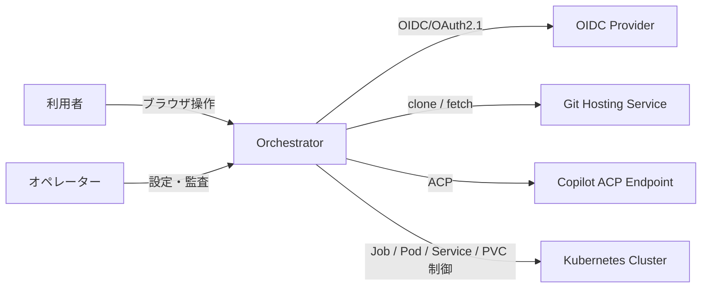
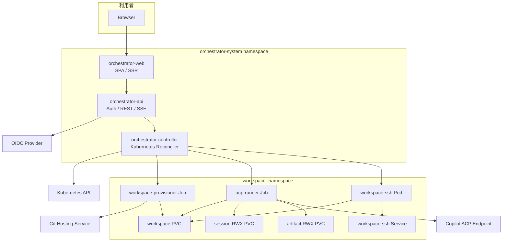
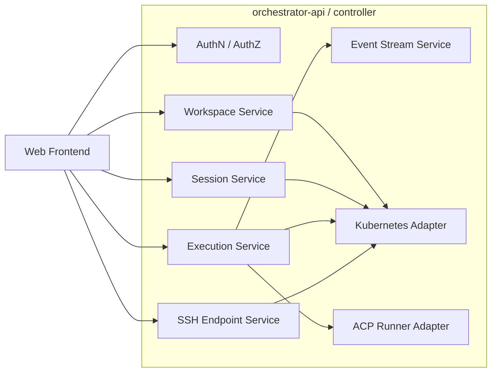
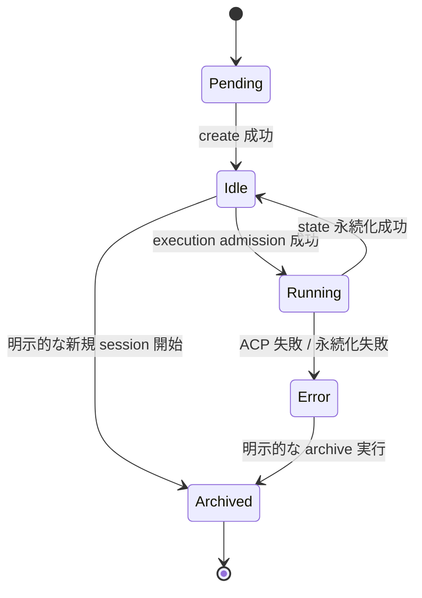
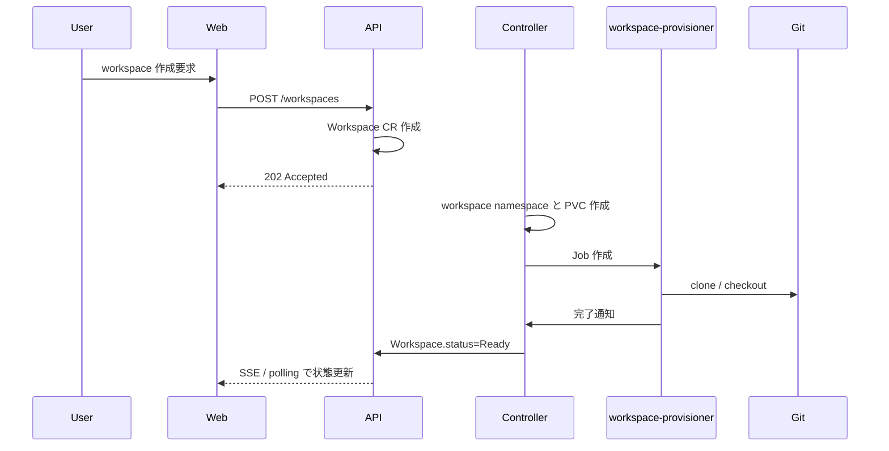
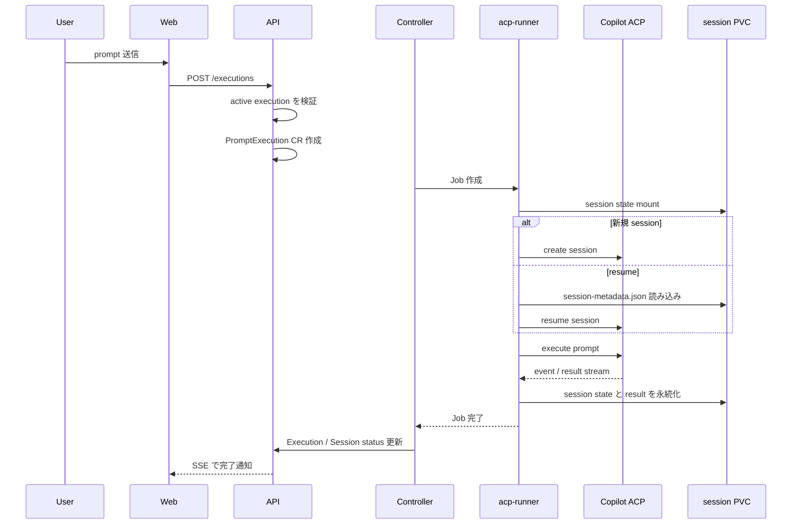
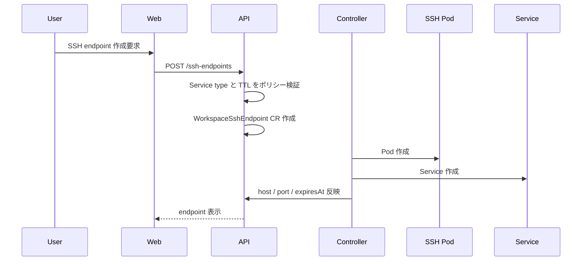

# Orchestrator 基本設計書

このページは、Kubernetes 専用の Orchestrator 機能の基本設計書です。要件は `docs/reference/orchestrator-requirements.md`、画面設計は `docs/reference/orchestrator-screen-design.md` を参照してください。

## 1. 設計方針

本設計は、既存リポジトリの次の前提を引き継ぎます。

- 実行は Kubernetes Job を主経路にする
- workspace は PVC、session state は RWX PVC へ永続化する
- SSH endpoint は必要時だけ作成する
- file handoff は既存の SSH/SFTP + `rclone` パターンを流用する
- Copilot 連携は ACP 経由で行い、runner を prompt 単位で終了させる

新規実装は、Web/API 層を追加しつつ、既存の Control Plane image と shell entrypoint を runner / SSH container のベースとして再利用する。

## 2. 全体構成

### 2.1 論理構成

- `orchestrator-web`: 認証付き Web フロントエンド
- `orchestrator-api`: REST API、認証、認可、イベント配信
- `orchestrator-controller`: Workspace / Session / Execution / SSHEndpoint の reconcile
- `workspace-provisioner` Job: git clone と初期化を担当
- `acp-runner` Job: Copilot session の create / resume / prompt 実行を担当
- `workspace-ssh` Pod: 任意要求時だけ起動する SSH endpoint

### 2.2 Kubernetes 配置

- `orchestrator-system` namespace
  - `orchestrator-web` Deployment
  - `orchestrator-api` Deployment
  - `orchestrator-controller` Deployment
- `workspace-<workspace-id>` namespace
  - workspace PVC
  - session RWX PVC
  - artifact RWX PVC
  - `workspace-provisioner` Job
  - `acp-runner` Job
  - `workspace-ssh` Pod / Service
  - Role / RoleBinding
  - ResourceQuota / LimitRange
  - NetworkPolicy

workspace ごとに namespace を分離し、tenant ごとの PVC、RBAC、NetworkPolicy、quota を独立させる。controller は `Workspace` 作成時に namespace と初期 resource を作成し、削除時に回収する。

### 2.3 Kubernetes 接続の前提

`orchestrator-api` と `orchestrator-controller` は Kubernetes への接続が確立できない限り readiness を返さない。UI は API の readiness を監視し、cluster 非接続時は書き込み操作を無効化する。

## 3. C4 モデル

### 3.1 System Context



### 3.2 Container



### 3.3 Component



## 4. Kubernetes リソース設計

### 4.1 Custom Resource

Kubernetes を唯一の永続状態ストアとして扱うため、次の CRD を定義する。

| リソース | 用途 | 主な status |
| --- | --- | --- |
| `Workspace` | git リポジトリ由来の作業領域 | `Pending`, `Cloning`, `Ready`, `Syncing`, `Error`, `Deleting` |
| `CopilotSession` | resume 対象の Copilot session | `Pending`, `Idle`, `Running`, `Error`, `Archived` |
| `PromptExecution` | 1 回の prompt 実行 | `Queued`, `Running`, `Succeeded`, `Failed`, `Cancelled` |
| `WorkspaceSshEndpoint` | 任意の SSH endpoint | `Pending`, `Ready`, `Expired`, `Error` |

### 4.2 Workspace

`Workspace.spec` の主要項目は次のとおりとする。

- `ownerRef`: 利用者 ID
- `displayName`: UI 表示名
- `repo.url`: git リポジトリ URL
- `repo.revision`: 初期 clone 対象 branch / tag / commit
- `gitCredentialRef`: Secret 参照
- `storage.size`: PVC サイズ
- `toolProfile`: 使用する runner / SSH image profile

`Workspace.status` は次を持つ。

- `phase`
- `workspacePvcName`
- `namespaceName`
- `currentRevision`
- `lastSyncedAt`
- `lastError`

### 4.3 CopilotSession

`CopilotSession` は workspace 単位で 1 つ active を許可する。session state 本体は shared RWX PVC の `sessions/<session-id>/` へ置き、CRD には参照情報だけを持たせる。
`CopilotSession` は workspace 単位で 1 つ active を許可する。session state 本体は workspace 専用の RWX PVC 上にある `sessions/<session-id>/` へ置き、CRD には参照情報だけを持たせる。

`CopilotSession.spec` の主要項目:

- `workspaceRef`
- `ownerRef`
- `resumePolicy`: `required`
- `replacementStrategy`: `explicit-only`
- `acpSessionId`
- `sessionPath`: `sessions/<session-id>`
- `resumeStatePath`: `sessions/<session-id>/session-metadata.json`

`CopilotSession.status` の主要項目:

- `phase`
- `lastExecutionRef`
- `lastResumedAt`
- `lastPersistedAt`
- `resumeFailures`
- `lastError`

### 4.4 PromptExecution

`PromptExecution` は 1 prompt = 1 レコードで扱う。

`PromptExecution.spec`:

- `workspaceRef`
- `sessionRef`
- `prompt`
- `resumeMode`: `create` または `resume`
- `requestedBy`

`PromptExecution.status`:

- `phase`
- `jobName`
- `startedAt`
- `finishedAt`
- `summary`
- `artifactPath`
- `failureReason`

### 4.5 WorkspaceSshEndpoint

`WorkspaceSshEndpoint.spec`:

- `workspaceRef`
- `requestedBy`
- `authorizedKeyRef`
- `serviceType`
- `ttlSeconds`

`WorkspaceSshEndpoint.status`:

- `phase`
- `podName`
- `serviceName`
- `host`
- `port`
- `expiresAt`

### 4.6 状態遷移

`CopilotSession` は次の状態遷移に限定する。



補足ルール:

- `Error` の session は `resume` 不可
- `Archived` の session は参照専用で再利用しない
- 新規 session 開始時は既存 session を archive してから create する
- `PromptExecution` は同一 workspace で `Queued` または `Running` を 1 件までとする

## 5. 永続化設計

### 5.1 PVC

- `workspace PVC`
  - 用途: git clone 済み working tree と生成物の保持
  - アクセスモード: `ReadWriteOnce`
- `session RWX PVC`
  - 用途: `~/.copilot/session-state`、実行メタデータ、resume 用 snapshot
  - アクセスモード: `ReadWriteMany`
- `artifact RWX PVC`
  - 用途: transcript、summary、stderr 断片、差分、SSH endpoint 監査
  - アクセスモード: `ReadWriteMany`

これら 3 つの PVC は workspace namespace ごとに 1 組作成する。

### 5.2 ディレクトリレイアウト

```text
 /workspace-namespace/session-pvc/
  sessions/<session-id>/
  executions/<execution-id>/
  audit/<yyyy>/<mm>/<dd>/

 /workspace-namespace/artifact-pvc/
  executions/<execution-id>/summary.json
  executions/<execution-id>/stdout.log
  executions/<execution-id>/stderr.log
  ssh/<endpoint-id>/access.log
```

workspace と session を分離することで、workspace の内容と session 復元情報を独立に寿命管理できる。

## 6. コンポーネント責務

### 6.1 orchestrator-web

- OIDC login / logout
- workspace 一覧、詳細、実行履歴、SSH endpoint 表示
- SSE による execution 状態追従
- 入力バリデーションと UI メッセージ表示

### 6.2 orchestrator-api

- OIDC token 検証
- workspace / session / execution / ssh endpoint の CRUD API
- `PromptExecution` 作成時の入力整形
- SSE channel 提供
- UI 向けの集約レスポンス生成
- Kubernetes 非接続時の `503 Service Unavailable` 応答
- 同一 workspace に active execution がある場合の `409 Conflict` 応答
- `LoadBalancer` を許可しない環境での SSH endpoint 要求拒否

### 6.3 orchestrator-controller

- CRD watch と Job / Pod / Service / PVC の reconcile
- workspace namespace と初期 resource の作成
- execution 完了後の state 反映
- TTL 切れ SSH endpoint の回収
- orphan resource の検出と修復
- Job finalizer と TTL による GC 制御

### 6.4 workspace-provisioner Job

- Secret から Git credential を取得する
- 空の workspace PVC に clone する
- 初期 revision を checkout する
- 完了後に `Workspace.status.phase=Ready` を返す
- 初期 clone 失敗時は `Workspace.status.phase=Error` とし、再試行時は workspace PVC を再作成する

### 6.5 acp-runner Job

- workspace PVC と session subPath を mount する
- `create` の場合は Copilot session を新規作成する
- `resume` の場合は session state を復元して prompt を続行する
- `session-metadata.json` に ACP session ID、最終 persist 時刻、resume 可否を保存する
- `resume` 時は `session-metadata.json` と session state の両方を検証し、欠損時は `Error` で停止する
- ACP イベントを要約し、artifact PVC へ保存する
- 完了時に session state を flush し、Job を終了する
- 成功時は controller が status 更新後に短い TTL で Job を回収し、失敗時は調査期間だけ残す

### 6.6 workspace-ssh Pod

- workspace PVC を read-write で mount する
- authorized key を Secret から受け取る
- `control-plane-ssh-shell` 相当の login shell を提供する
- TTL 超過時に controller から削除される
- Service type は API で検証済みの値だけを受け取り、`LoadBalancer` の場合は監査イベントを残す

## 7. 処理シーケンス

### 7.1 workspace 作成



### 7.2 prompt 実行と resume



### 7.3 SSH endpoint 発行



## 8. API 設計

主要 endpoint は次を想定する。

- `GET /api/workspaces`
- `POST /api/workspaces`
- `GET /api/workspaces/{workspaceId}`
- `POST /api/workspaces/{workspaceId}/executions`
- `GET /api/workspaces/{workspaceId}/executions`
- `POST /api/workspaces/{workspaceId}/sessions/{sessionId}/resume`
- `POST /api/workspaces/{workspaceId}/ssh-endpoints`
- `DELETE /api/workspaces/{workspaceId}/ssh-endpoints/{endpointId}`

書き込み系 API は即時完了を返さず、Kubernetes resource 作成完了時点で `202 Accepted` を返し、詳細状態は SSE または後続 GET で確認する。

主なエラー応答:

- `409 Conflict`: 同一 workspace で active execution が存在する
- `422 Unprocessable Entity`: SSH service type や TTL が管理者ポリシーに違反する
- `503 Service Unavailable`: Kubernetes 非接続で readiness が落ちている

## 9. セキュリティ設計

- 認証は OIDC/OAuth2.1 とし、frontend は session cookie、API は署名済みトークンを検証する
- Git credential、Copilot credential、SSH authorized key は Kubernetes Secret で管理する
- API は owner label と認証主体を照合し、他人の workspace を参照させない
- SSH endpoint の Service type は既定で `ClusterIP` とし、`LoadBalancer` は管理者ポリシーで許可された場合だけ選択可能にする
- `LoadBalancer` 作成は必ず監査イベント化し、UI でも公開状態を強調表示する
- workspace namespace ごとに RBAC、NetworkPolicy、quota を分離する
- runner / SSH Pod には必要最小限の RBAC と NetworkPolicy を適用する

## 10. 障害設計

- workspace clone 失敗時は `Workspace.status.phase=Error` とし、再試行時は workspace PVC を再作成する
- ACP `resume` 失敗時は `CopilotSession.status.phase=Error` とし、自動で新規 session へ切り替えない
- session metadata または session state が欠損している場合は `ResumeStateMissing` を失敗理由として返す
- execution 完了後に artifact 保存が失敗した場合は Job を `Failed` とし、失敗 Job を 24 時間保持する
- 成功した runner / provisioner Job には `ttlSecondsAfterFinished=300` を設定する
- SSH endpoint の TTL 回収では `Service` を先に削除し、30 秒の grace period 後に `Pod` と Secret を削除する
- SSH endpoint の TTL 回収に失敗した場合は controller が backoff 付きで再試行し、監査イベントを残す

## 11. 既存実装の再利用ポイント

- Job 実行の基本経路は `containers/control-plane/bin/control-plane-run` と `containers/control-plane/bin/k8s-job-run`
- Job 起動時の file handoff と競合検知は `containers/control-plane/bin/k8s-job-start` と `containers/control-plane/bin/control-plane-job-transfer`
- session attach / screen 運用の知見は `containers/control-plane/bin/control-plane-session`
- SSH login shell の挙動は `containers/control-plane/bin/control-plane-ssh-shell`
- session / config / SSH host key の永続化パターンは `deploy/kubernetes/control-plane.example.yaml` と `docs/explanation/knowledge.md`

今回の実装では、これらの runtime surface を Web/API から安全に呼び出せるよう抽象化する。

## 12. 既存 script 再利用時の適応条件

- `control-plane-run` と `k8s-job-run` は API から直接叩かず、controller が workspace namespace ごとの env と mount を注入して呼び出す
- `k8s-job-start` と `control-plane-job-transfer` は workspace namespace 内の Secret、PVC、SSH host key に限定して使う
- `control-plane-session` は SSH Pod の対話 shell だけで使い、API 駆動の runner Job では使わない
- `control-plane-ssh-shell` は workspace 固有の authorized key と PVC mount を前提に wrapper 化する
- `runtime.env` 相当の設定ファイルは共有 home 配下へ置かず、Job / Pod ごとに生成して隔離する
