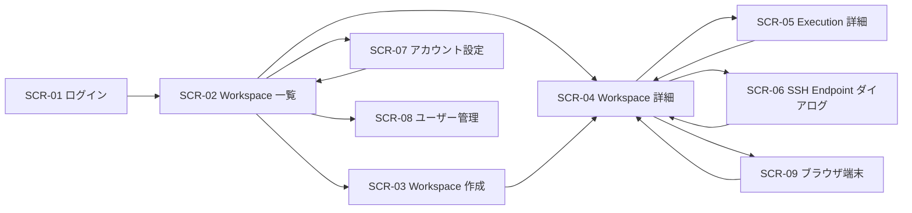

# Orchestrator 画面設計書

このページは、Kubernetes 専用の Orchestrator 機能の画面設計書です。要件は `docs/reference/orchestrator-requirements.md`、基本設計は `docs/reference/orchestrator-basic-design.md` を参照してください。

## 1. 画面一覧

| 画面 ID | 画面名 | 用途 |
| --- | --- | --- |
| SCR-01 | ログイン | ID/パスワードによる認証 |
| SCR-02 | Workspace 一覧 | 作成済み workspace と最新状態の確認 |
| SCR-03 | Workspace 作成 | git リポジトリから新規 workspace を作成 |
| SCR-04 | Workspace 詳細 | prompt 実行、session 状態、履歴、SSH endpoint の確認 |
| SCR-05 | Execution 詳細 | prompt 実行結果とログ断片の確認 |
| SCR-06 | SSH Endpoint ダイアログ | SSH endpoint の払い出しと解放 |
| SCR-07 | アカウント設定 | 自分の password と資格情報の管理 |
| SCR-08 | ユーザー管理 | 管理者によるユーザー管理 |
| SCR-09 | ブラウザ端末 | ClusterIP endpoint への terminal login |

## 2. 画面遷移

## 3. SCR-01 ログイン

### 3.1 目的

未認証ユーザーに対して、ローカル ID/パスワード認証でアプリの session を確立する。

### 3.2 表示項目

- アプリ名
- 説明文
- Login ID 入力欄
- Password 入力欄
- `ログイン` ボタン
- 認証失敗メッセージ領域
- password 変更要求メッセージ領域

### 3.3 操作

- `ログイン`: 入力した ID/Password で認証する

### 3.4 バリデーション / メッセージ

- 認証失敗時: `ログインに失敗しました。再度お試しください。`
- アカウントロック時: `このアカウントはロックされています。管理者へ連絡してください。`
- 初期パスワード時: `初回ログインのため、パスワード変更が必要です。`
- 権限不足時: `この環境へのアクセス権がありません。`

## 4. SCR-02 Workspace 一覧

### 4.1 目的

ユーザーが利用可能な workspace と最新状態を俯瞰する。

### 4.2 主なレイアウト

- ヘッダー
  - ユーザー名
  - `Workspace を作成`
  - `アカウント設定`
  - 管理者のみ `ユーザー管理`
  - `ログアウト`
- 一覧テーブル
  - workspace 名
  - git リポジトリ
  - current revision
  - session 状態
  - 最新 execution 結果
  - SSH endpoint 状態
  - 更新日時

### 4.3 操作

- 行クリック: `SCR-04 Workspace 詳細` へ遷移
- `Workspace を作成`: `SCR-03 Workspace 作成` へ遷移
- `再読込`: 一覧の再取得

### 4.4 表示ルール

- `Cloning`, `Running`, `Error` はバッジで強調表示する
- active session が無い場合は `Idle` ではなく `Not Started` と表示する
- SSH endpoint が無い場合は `Disabled` と表示する
- cluster 非接続時は一覧上部に障害バナーを出し、`Workspace を作成` を無効化する

## 5. SCR-03 Workspace 作成

### 5.1 入力項目

| 項目 | 必須 | 説明 |
| --- | --- | --- |
| Workspace 名 | 必須 | UI 表示名。ユーザー単位で一意 |
| Git Repository URL | 必須 | clone 対象 URL |
| Branch / Revision | 必須 | 初期 checkout 対象 |
| Storage Size | 必須 | workspace PVC 容量 |
| Tool Profile | 必須 | 実行 image profile |

### 5.2 操作

- `作成`: 入力内容で workspace 作成を開始
- `キャンセル`: `SCR-02` へ戻る

### 5.3 バリデーション

- Workspace 名は英数字・`-`・`_` のみ許可
- Git URL は `https://` または `git@` を許可
- Storage Size は管理者定義の上限以内
- 同名 workspace がある場合は作成不可
- private repository を指定した場合、SCR-07 に保存済みの GitHub 認証情報が無いと作成不可

### 5.4 完了後の遷移

- 受理後は `SCR-04` へ遷移し、workspace 状態を `Cloning` で表示する

## 6. SCR-04 Workspace 詳細

### 6.1 目的

workspace の現在状態、session、prompt 実行、履歴、SSH endpoint を一箇所で扱う。

### 6.2 レイアウト

- 概要パネル
  - workspace 名
  - git URL
  - current revision
  - workspace 状態
  - 最終同期時刻
- session パネル
  - session ID
  - 状態
  - 最終 resume 時刻
  - `新規 session を開始`
  - `session を archive`
  - `resume して実行`
- prompt パネル
  - multi-line prompt 入力欄
  - `実行`
  - `実行中止`
- execution 履歴パネル
  - execution 一覧
  - 開始時刻 / 終了時刻 / 結果 / 要約
- SSH endpoint パネル
  - endpoint 状態
  - host / port
  - expiration
  - `SSH endpoint を作成`
  - `SSH endpoint を削除`
  - `ブラウザ端末を開く`

### 6.3 操作ルール

- workspace が `Ready` でない場合、`実行` を無効化する
- workspace が `Error` かつ clone failure の場合、`実行` を無効化し、`初期 clone を再試行` を表示する
- session が `Error` の場合、`resume して実行` を無効化し、`新規 session を開始` のみ有効化する
- `新規 session を開始` は replacement session の作成成功後に旧 session を archive する確認ダイアログを経由する
- `新規 session を開始` と `session を archive` は execution が `Running` の間は無効化する
- execution が `Running` の間は prompt 入力欄を read-only にする
- `実行中止` は execution が `Running` の間だけ有効化する
- SSH endpoint 作成中は二重作成を防ぐためボタンを無効化する
- `ClusterIP` endpoint が `Ready` の場合だけ `ブラウザ端末を開く` を有効化する
- `LoadBalancer` endpoint を作る場合、保存済み SSH 公開鍵が無いと `SSH endpoint を作成` を無効化する
- cluster 非接続時はすべての変更操作を無効化する

### 6.4 実行中 UI

- 上部に進行状況バナーを表示する
- SSE で受け取った log / event を時系列で表示する
- 完了後は `summary` と `最終更新ファイル一覧` を折りたたみ表示する

### 6.5 エラーメッセージ

- resume 失敗: `保存済み session を復元できませんでした。内容を確認して新規 session を開始してください。`
- runner 起動失敗: `Execution Job の起動に失敗しました。cluster 状態を確認してください。`
- 同時実行競合: `別の prompt 実行が進行中です。完了後に再試行してください。`
- 中止完了: `実行を中止しました。session は Error 状態になりました。必要なら archive 後に新規 session を開始してください。`
- 資格情報不足: `必要な資格情報が未設定です。アカウント設定を確認してください。`
- 権限不足: `この workspace を操作する権限がありません。`

## 7. SCR-05 Execution 詳細

### 7.1 目的

1 回の prompt 実行結果を詳細に確認する。

### 7.2 表示項目

- prompt 本文
- 実行モード (`create` / `resume`)
- execution 状態
- 開始時刻 / 終了時刻 / 実行時間
- summary
- stdout / stderr 抜粋
- 更新ファイル一覧
- 関連 session ID

### 7.3 操作

- `Workspace 詳細へ戻る`
- `同じ session を resume`
- `ログ全文をダウンロード`

### 7.4 表示ルール

- `Failed` の場合は失敗フェーズを先頭表示する
- `Cancelled` の場合は中止時点までの summary とログ断片を表示する
- `Succeeded` の場合でも runner が終了済みであることを明示する

## 8. SCR-06 SSH Endpoint ダイアログ

### 8.1 目的

workspace に対する一時 SSH endpoint を要求・解除する。

### 8.2 入力項目

| 項目 | 必須 | 説明 |
| --- | --- | --- |
| Service Type | 必須 | 管理者ポリシーで許可された型のみ表示。既定は `ClusterIP` |
| SSH Public Key | 条件付き必須 | `LoadBalancer` のときだけ、保存済み公開鍵一覧から選択 |
| TTL | 必須 | endpoint の有効期限 |

### 8.3 操作

- `作成`: endpoint 作成要求
- `削除`: 既存 endpoint を削除
- `閉じる`: ダイアログを閉じる

### 8.4 バリデーション

- `LoadBalancer` のときは保存済み公開鍵が 1 つ以上必要
- TTL は管理者定義の上限以内
- 既存 endpoint が `Ready` の場合、`作成` は無効化する
- `LoadBalancer` が許可されていない環境では選択肢自体を表示しない
- `ClusterIP` のときは内部生成鍵を使うことを説明表示する
- 公開鍵選択欄は key 名と fingerprint を表示する

### 8.5 完了表示

- `Ready` 時に host / port / expiresAt / 接続例を表示する
- `ClusterIP` のときは `ブラウザ端末を開く` 導線を表示する
- `Expired` または `Deleted` になった場合は接続情報を非表示にする

## 9. SCR-07 アカウント設定

### 9.1 目的

ユーザーが自分の password と資格情報を管理する。

### 9.2 主なレイアウト

- プロフィール領域
  - Login ID
  - 表示名
  - ロール
- password 変更領域
  - 現在 password
  - 新 password
  - 新 password 確認
- GitHub 認証情報領域
  - `gh-hosts.yml` または token の入力
  - `保存`
- Copilot 認証情報領域
  - token 入力
  - `保存`
- Docker 認証情報領域
  - `docker-config.json` または username/password の入力
  - `保存`
- SSH 公開鍵領域
  - 登録済み公開鍵一覧（名前 / fingerprint）
  - 追加 / 削除

### 9.3 操作ルール

- 自分以外の資格情報は参照できない
- password 変更成功時は再ログインを要求する
- Secret の実値は保存後に再表示しない

### 9.4 バリデーション

- password は policy に従う
- SSH 公開鍵は OpenSSH 形式のみ許可
- 同じ fingerprint の公開鍵は重複登録できない
- Docker 認証情報は JSON 形式または username/password のどちらか一方だけを受け付ける

## 10. SCR-08 ユーザー管理

### 10.1 目的

管理者がローカルユーザーを作成・無効化・保守する。

### 10.2 主なレイアウト

- ユーザー一覧テーブル
  - Login ID
  - 表示名
  - ロール
  - 状態
  - 最終ログイン
- 操作パネル
  - `ユーザー作成`
  - `無効化`
  - `初期パスワード再発行`
  - `ロール変更`

### 10.3 操作ルール

- 管理者以外は遷移できない
- password 再発行時は一時 password を 1 回だけ表示する
- 無効化したユーザーの login cookie は失効し、実行中 execution は中止、SSH endpoint と browser terminal は閉じる

## 11. SCR-09 ブラウザ端末

### 11.1 目的

`ClusterIP` の SSH endpoint に対し、画面上から terminal login を行う。

### 11.2 主なレイアウト

- terminal 表示領域
- 接続状態バッジ
- `接続準備中` 表示
- 残り有効期限
- `再接続`
- `閉じる`

### 11.3 操作ルール

- `ClusterIP` endpoint が `Ready` のときだけ開ける
- 内部生成した一時 SSH 鍵を使うため、秘密鍵は UI に表示しない
- terminal は `BrowserTerminalSession=Ready` になるまで `接続準備中` を表示する
- terminal を閉じると browser terminal session の回収を開始する

### 11.4 エラーメッセージ

- 接続失敗: `terminal 接続を確立できませんでした。SSH endpoint 状態を確認してください。`
- TTL 切れ: `terminal session の有効期限が切れました。再度開き直してください。`

## 12. 共通 UI ルール

- phase 表示は Kubernetes status と同じ語彙を使う
- destructive action には確認ダイアログを出す
- Secret 値は再表示しない
- polling より SSE を優先し、接続断時だけ fallback polling を使う
- `LoadBalancer` の SSH endpoint は公開状態であることを警告表示する

## 13. 空状態と障害状態

### 10.1 Workspace 一覧が空

- 文言: `まだ workspace がありません。Git リポジトリから最初の workspace を作成してください。`

### 10.2 execution 履歴が空

- 文言: `まだ prompt 実行履歴がありません。最初の prompt を実行してください。`

### 10.3 cluster 障害

- 文言: `Kubernetes API への接続に失敗しました。しばらくしてから再試行してください。`

### 13.4 認証期限切れ

- 文言: `認証の有効期限が切れました。再ログインしてください。`
